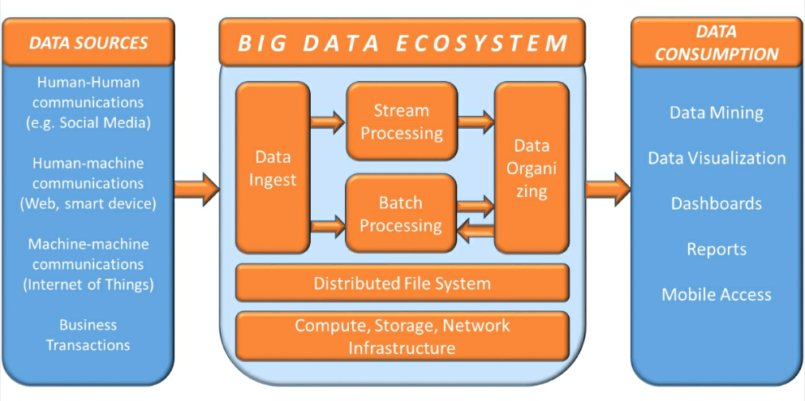

overview
========
- Big data is a field that treats ways to analyze, systematically extract
  information from, or otherwise deal with data sets that are too large or
  complex to be dealt with by traditional data-processing methods.

  这里, 传统数据处理方法, 指的是传统的 RDBMS, 办公软件等.

- 大数据也指这种 extremely large, very fast, highly diverse, and complex
  的数据.

- 大数据概念的重点在于数据量之大, 已经无法用传统方法有效地处理. 我们需要研究
  大数据, 就是因为在一些场景下数据量已经这样庞大.

- 大数据解决的是传统数据处理方法解决不了的问题. 这有多方面的理解:
  
  * 很多技术领域都会遇到大数据量带来的新问题, 因此就存在大数据技术在这些领域的
    渗透应用. 从这个角度来看, 大数据技术, 可以是任何领域的技术, 只要是对极大
    数据量的处理进行专门开发的.
    
  * 另一方面, 任何业务领域都可能遇到大数据量带来的问题, 尤其是数据存储和计算
    需求. 对这些问题的解决, 需要将存储和计算从原来的架构中解耦合, 集中到新的
    专门为解决这些问题而开发的系统中来. 从这个角度来看, 大数据技术是一个全新
    的计算机技术领域, 它专门解决由于极大的数据量这个特征所带来的各方面问题.

  这些角度, 也解释了为什么大数据领域这么地庞杂.

- 大数据分析的两种方式:

  * 流处理 (stream processing). process the incoming stream of data in real
    time for quick and effective statistics about the data.

  * 批处理 (batch processing). store and structure batches of data and apply
    standard analytical techniques for generating insights.

characteristics
===============
- 4Vs -- volume, variety, velocity, veracity.

volume
------
- Traditional data is measured in GB and TB. Big data is measured in PB and EB.

- reasons for the growth of data:
  
  * the dramatic reduction in the cost of storing data.

  * The costs of computation and communication of data have also been coming
    down.

  * the increase in the number of forms and functions of data.

velocity
--------
- 由于数据往往是实时地、大量地 "流入", 而不是像在传统领域, 数据是间断地、一段一
  段地 "接收", 在大数据领域, data ingesting 常常比喻为一个数据流 (data-stream).

- reasons for the increased velocity of data:

  * the increase in network bandwidth.

  * the increased variety of sources.

variety
-------
- major aspects of variety of data.

  * the form of data. text, graph, map, audio, video, and composite data types.

  * the function of data. data of human conversation, songs, movies, business
    transaction records, machine operation logs, etc. data of different
    function need to be processed very differently.

  * the source of data. 3 types of data sources: human-human communications,
    human-machine communications, machine-machine communications.

veracity
--------
- truthfulness, believability, quality of data.

- reasons for poor quality of data.

  * The source of information may not be authoritative.

  * The data may not be communicated and received correctly because of human
    or technical failure.

  * The data provided and received may be intentionally wrong.

big data challenges
===================
- 由于大数据的 4Vs 极端特性, 对大数据的处理面临全流程的一系列新的挑战. 这包括:

  * storing huge volumes of data (volume). 解决办法是将数据分布式地存储在由低成
    本机器组成的集群中, 并通过复制避免数据损失. 典型系统是: Google Big File
    system, Hadoop Distributed File System.

  * ingesting streams at an extremely fast pace (velocity). 解决办法是 creating
    scalable ingesting systems that can open an unlimited number of channels
    for receiving data. 典型系统是: Apache Spark.

  * Accessing and analyzing all varieties of data (variety). 解决办法是 storing
    data in non-relational systems that relax many of the stringent conditions
    of the relational model -- i.e., NoSQL databases. 典型系统是: Apache HBase,
    Apache Cassandra. 以及相关的系统: Apache Pig and Apache Hive.

  * Processing data at huge speed (volume & velocity). 解决办法是 move the
    processing to where the data is stored, avoiding choking the network. 典型
    系统: MapReduce.
  
architecture
============

data sources
------------
human-human communications
^^^^^^^^^^^^^^^^^^^^^^^^^^
examples:

- social media

  * In social media, people communicate with asynchronous messages. 注意只需要
    发送方把消息发出至接收方即完成了发送操作, 无需等待接收方读到消息. 因此是
    异步的.

human-machine communications
^^^^^^^^^^^^^^^^^^^^^^^^^^^^
examples:

- physical sensors

- world wide web

- personal assistant

- wearable devices

machine-machine communications
^^^^^^^^^^^^^^^^^^^^^^^^^^^^^^
examples:

- IoT

  * RFID (radio frequency identification). An RFID tag responds to and
    communicate with a special reader via RF channel.

  * Sensors observe and record physical and chemical parameters in environment.

standard big data architecture
------------------------------
workflow
^^^^^^^^
- data are ingested from multiple data sources.

- Then data is forked into two processing systems:

  * A stream processing system

  * A batch processing system

- The outcome of these processing systems are
  
  * sent into NoSQL databases for later retrieval

  * directly sent for consumption by applications

layers
^^^^^^
- data source layer

  * The choice of sources of data for an application depends upon what data is
    required to perform the kind of analyses you need.

- data ingest layer

  * responsible for acquiring data from data sources.

  * there may be a scalable set of input points

- stream processing layer

  * input data from the ingest point, process in real time

  * output data to distributed file system or NoSQL database.

- batch processing layer

  * input data from the ingest point or distributed file system or NoSQL
    database.

  * output data to distributed file system, reporting, or NoSQL database.

- data orgranizing layer

  * represented by NoSQL databases

  * receive data from batch and stream processing layers.

- infrastructure layer

  * manage hardware resources

  * probably provided by cloud platform.

- distributed file system layer

  * 上层必须能快速而安全地访问存储的数据, 它要提供高可用性.

- data consumption layer

common architectures
--------------------
- ingest:

  * kafka

- stream processing:

  * spark streaming

  * storm

  * flink

  * samza

- batch processing:

  * hive

  * mapreduce

- data organzing:

  * hbase

  * Cassandra

  * druid

  * gemfire

  * titan graphical database

- distributed file system:

  * hdfs

  * aws s3

  * parquet

- data consumption:

  * excel

  * tableau

  * spark sql

applications
============
- 多个领域的发展都遇到了大数据问题, 因此需要发展相应的大数据处理方法. 例如:
  internet search, fintech, informatics, genomics, complex physics simulations,
  IoT, social media, etc.

- 3 major types of big data applications:

  * monitoring and tracking applications. 这是关于 "过去" 的大数据应用.

  * analysis and insight applications. 这是关于 "未来" 的大数据应用.

  * new product development.

monitoring and tracking applications
------------------------------------
- these are basic applications of big data. They help improve the efficiency.

- examples:

  * public health monitoring

  * consumer sentiment monitoring

  * asset tracking

  * supply chain monitoring

  * electricity consumption tracking

  * preventive machine maintenance

analysis and insight applications
---------------------------------
- next level applications of big data. They help improve the effectiveness
  of business.

- examples

  * predictive policing

  * winning policitical election

  * personal health -- disease diagnosis

new product development
-----------------------
- these application introduces totally new concepts that did not exist earlier.
  They have transformational potential to disrupt entire industry.

- examples.
  
  * Searching the world wide web was the first true big data application.
    Google perfected this application and developed many path-breaking big data
    technologies we see in use today.

  * flexible auto insurance

  * location-based retail promotion

  * recommendation service

visions to build big data system
================================
- 构建一个大数据平台应该首先从一个 proven architecture 出发, 然后根据需求
  来创造性地、循序渐进地改进和增删优化组件.

- big data should be used to solve a real pain-point. It should be deployed for
  specific business objectives in order to have management avoid being
  overwhelmed by the enormity of Big Data.

- Organizations should begin their pilot implementations by using existing and
  newly accessible internal sources of data.

- Putting humans and data together leads to the most insights. Combining
  data-based analysis with human intuition and perspectives is better than
  going just one way.

- The faster one analyzes the data, the more will be its predictive value.

- One should not throw away data if no immediate use can be seen for it. Data
  usually has value beyond what one initially anticipates.

- Big Data is growing exponentially, so one should plan for exponential growth.
history
=======
Google
------
google 为了做搜索引擎这个大数据应用, 发明了一系列大数据技术.

- google 开发了网络爬虫技术 (web crawling agents). 爬虫 follow 每个网页链接,
  将获取到的页面结果缓存下来.

- Google File System. google 开发的这个分布式文件系统, 可以线性水平扩展. 为了
  存放爬虫缓存下来的所有网页. 这是 Hadoop 的源头.

- NoSQL database. google 为了对庞大的网页数据进行索引, 便于搜索, 发明了
  key-value 式的 NoSQL 数据库. 这是 HBase 的源头.

- MapReduce parallel processing architecture. google 为了能够对巨量的分布式的数
  据进行计算, 发明了 MapReduce 计算模型. 这是 Hadoop MapReduce 计算模型的源头.
