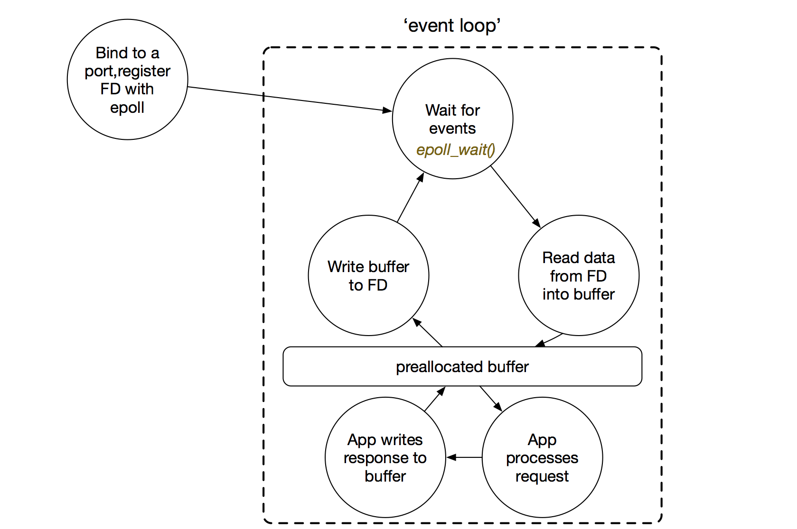

engine internals
================

- JS engine is based on single-threaded event loop -- An loop where execution
  is triggered by event queue. Each time a javascript thread of execution
  finishes, it checks to see if there is another event in the queue to process.
  If there is, it pulls it off the queue and executes that event's callbacks.
  There doesn't need to be any polling by the engine. If nothing is in the
  event queue, then the JS interpreter has free time (garbage collection or
  idle) until some external agent puts something else in the event queue and
  wakes it up again.[SOAjaxBackground]_

- nodejs 底层使用 libuv 做异步 IO. libuv 则基于 epoll (linux), kqueue (bsd)
  等. 这是异步 IO 的本质. See the following diagram [EventLoop]_
 
  |eventloop|

References
==========

.. [SOAjaxBackground] `How does JavaScript handle AJAX responses in the background? <https://stackoverflow.com/questions/7575589/how-does-javascript-handle-ajax-responses-in-the-background>`_
.. [EventLoop] `What exactly is an Event-loop? <https://blog.rapid7.com/2016/07/27/what-exactly-is-an-event-loop/>`_
